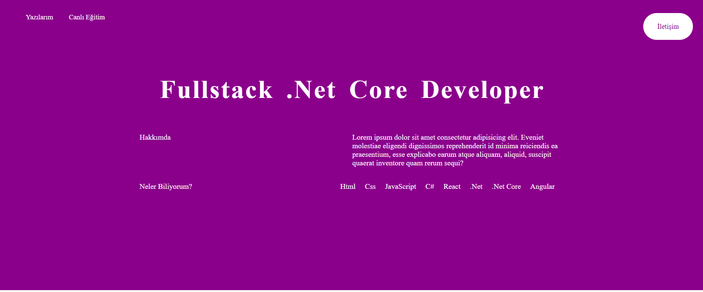
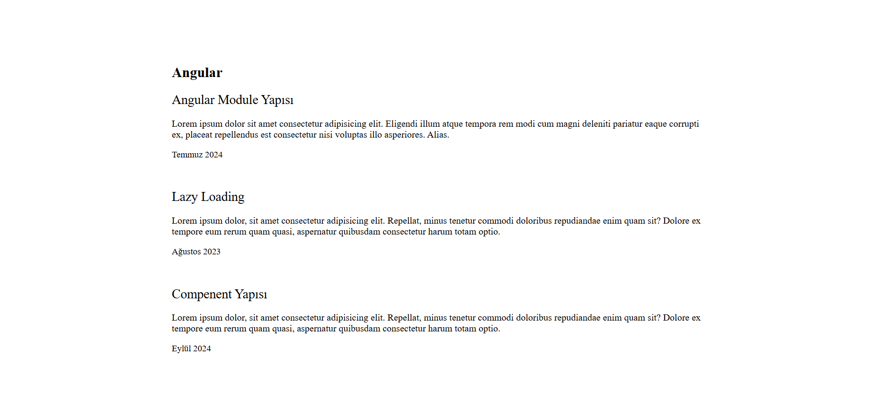
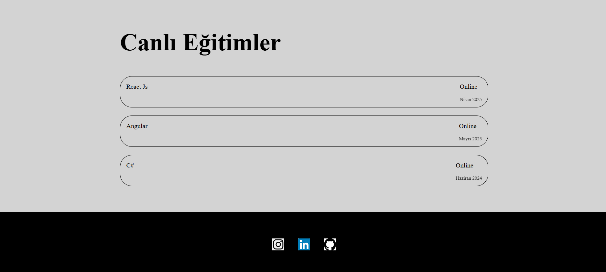

# Web Tasarım Projesi

Bu proje, temel HTML ve CSS kullanarak bir web sayfası tasarlama çalışmasıdır. Sayfa, modern bir görünüme sahip olmakla birlikte responsive tasarım prensiplerini de desteklemektedir.

## İçindekiler

- [Proje Hakkında](#proje-hakkında)
- [Kullanılan Teknolojiler](#kullanılan-teknolojiler)
- [Özellikler](#özellikler)
- [Ekran Görüntüleri](#ekran-görüntüleri)

---

## Proje Hakkında

Bu proje, frontend geliştirme becerilerini geliştirmek amacıyla tasarlanmıştır. Sayfa şu bölümlerden oluşmaktadır:

1. **Başlık ve Navigasyon Çubuğu**: Sayfa başında gezinme çubuğu ve iletişim butonları.
2. **Hakkımda**: Kullanıcının kısa bir biyografisini içeren bölüm.
3. **Yetenekler**: Yeteneklerin listelendiği ve görselleştirildiği alan.
4. **Blog**: Blog yazıları için tasarlanmış bölüm.
5. **Eğitim**: Kullanıcının eğitim geçmişini içeren kartlar.
6. **İletişim**: İletişim ikonları ve bilgileri.

---

## Kullanılan Teknolojiler

Proje aşağıdaki teknolojileri kullanmaktadır:

- **HTML5**: Yapısal iskelet.
- **CSS3**: Görselleştirme ve stil düzenlemeleri.
- **Flexbox & Grid**: Duyarlı yerleşim tasarımı.

---

## Özellikler

- **Responsive Tasarım**: Mobil, tablet ve masaüstü cihazlara uyumludur.
- **Modern Stil**: Minimal ve profesyonel bir görünüm sağlanmıştır.
- **Kolay Uyarlama**: Renkler ve düzen değişkenler ile kolayca özelleştirilebilir.
- **Hover Efektleri**: Dinamik kullanıcı deneyimi için geçiş animasyonları eklenmiştir.

---

## Ekran Görüntüleri

### Ana Sayfa


### Blog


### Education-contact

---

## Kurulum

Bu projeyi çalıştırmak için aşağıdaki adımları izleyin:

1. **Projeyi Klonlayın**:
   ```bash
   git clone https://github.com/beratctnr/Cv-website.git
